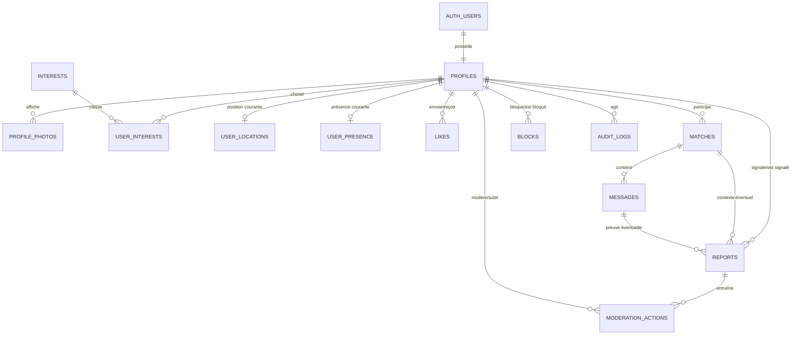

# Base de données Leco

Ce document décrit le socle PostgreSQL/PostGIS du MVP. La migration
`0001_initial_schema.sql` crée les données métier, les invariants techniques et
les RPC sensibles. La migration de sécurité `0002` est responsable des
politiques RLS détaillées.

## Modèle relationnel



Les relations à deux utilisateurs utilisent des noms explicites :
`sender_id`/`recipient_id`, `blocker_id`/`blocked_id` et
`user_low_id`/`user_high_id`. Dans `matches`, les UUID sont toujours rangés
lexicographiquement ; une contrainte et une unicité empêchent deux matchs pour
la même paire.

## Tables et invariants

| Table | Rôle | Invariants principaux |
| --- | --- | --- |
| `profiles` | Profil lié 1:1 à `auth.users` | 18 ans minimum, bio ≤ 150 caractères, téléphone absent, suspension/désactivation explicites |
| `profile_photos` | Références Cloudinary | 2 à 4 pour compléter le profil, positions 1 à 4 uniques, URL HTTPS |
| `interests`, `user_interests` | Référentiel et choix | 2 à 3 choix pour compléter le profil, maximum 3 garanti en base |
| `user_locations` | Une position exacte courante | `geography(Point,4326)`, expiration ≤ 30 min, index GiST, aucun historique |
| `user_presence` | Disponibilité courante | mood obligatoire si disponible, heartbeat frais ≤ 5 min pour la découverte |
| `likes` | Intentions « Dire bonjour » | pas d’auto-like, une intention `pending` par direction, 5/heure |
| `matches` | Relation mutuelle | paire canonique unique, création atomique |
| `messages` | Texte et emoji uniquement | 1 à 2 000 caractères, match actif, membres non bloqués, hash anti-duplication |
| `blocks` | Blocage directionnel | paire unique ; annule immédiatement les likes et désactive le match |
| `reports` | File de signalements | catégorie normalisée, contexte match/message optionnel, décision traçable |
| `moderation_actions` | Décisions de modération | modérateur, cible, justification et expiration éventuelle |
| `audit_logs` | Journal administratif | append-only, métadonnées JSON sans PII |

Les minima de 2 photos et 2 intérêts sont pris en compte par
`is_profile_complete`. Ils ne sont pas imposés pendant l’onboarding afin de
permettre une saisie progressive. Les maxima sont protégés par verrous
transactionnels pour éviter les courses concurrentes.

## Localisation et découverte

`user_locations` ne contient que la dernière position et n’accorde aucun
privilège direct à `anon` ou `authenticated`. Le frontend ne doit jamais lire
cette table. Il appelle :

- `update_my_location(latitude, longitude, accuracy)` pour remplacer sa propre
  position ; la fonction ne retourne aucune coordonnée ;
- `get_nearby_profiles(radius, limit)` pour obtenir des profils et l’une des
  catégories `TOUT_PRES`, `MOINS_DE_500_M`,
  `ENTRE_500_M_ET_1_KM`, `DANS_TON_SECTEUR`.

La découverte accepte uniquement les rayons 1, 3, 5 et 10 km. Elle utilise
`ST_DWithin`, calcule la distance exacte uniquement dans PostgreSQL, puis
ordonne les résultats avec une permutation renouvelée toutes les 15 minutes.
Elle ne retourne ni latitude, ni longitude, ni distance numérique, ni date de
capture. Les blocages sont exclus dans les deux directions.

## Présence et expiration

`activate_presence` exige un profil complet, actif et une localisation non
expirée. La durée est comprise entre 15 minutes et 4 heures.
`heartbeat_presence` rafraîchit la présence active. Même avant le passage du
job de nettoyage, `get_nearby_profiles` ignore tout heartbeat vieux de plus de
5 minutes et tout mood expiré.

`expire_stale_presence()` est réservé au rôle serveur. Il doit être exécuté
chaque minute via Supabase Cron ou un ordonnanceur équivalent. Il passe les
présences périmées hors ligne et supprime les positions expirées.
`deactivate_presence()` retire immédiatement la position de l’utilisateur.

## Matching et anti-abus

`send_hello(recipient_id)` réalise dans une seule transaction :

1. authentification et validation des deux profils ;
2. verrouillage de la paire d’utilisateurs ;
3. contrôle des blocages et d’une intention déjà en attente ;
4. limite de cinq demandes par heure et limite journalière configurée dans
   `private.app_settings` (`hello_daily_limit`, 25 par défaut) ;
5. insertion de l’intention ;
6. détection et verrouillage de l’intention réciproque ;
7. création/réactivation du match et passage des deux intentions à `matched`.

Un trigger sur `messages` refuse tout envoi hors d’un match actif, après
blocage, par un non-membre ou par un compte non actif. Après cinq contenus
normalisés identiques en une heure, le message suivant est refusé. Le rate
limiting applicatif peut appliquer un ralentissement plus progressif en amont.

## RLS et responsabilités de la migration 0002

RLS est activé dès `0001` sur toutes les tables du schéma `public`. Aucune
politique permissive n’est créée ici : une table sans politique refuse les
accès clients. La migration `0002` doit notamment :

- rendre visibles uniquement les champs publics autorisés de `profiles` ;
- interdire toute lecture directe de `user_locations` ;
- limiter likes, matchs, messages et blocages aux utilisateurs concernés ;
- rendre les signalements visibles à leur auteur et aux modérateurs habilités ;
- réserver `moderation_actions` et `audit_logs` aux administrateurs avec MFA ;
- conserver les mutations sensibles derrière les RPC sécurisées.

Toutes les fonctions `security definer` utilisent un `search_path` vide,
valident `auth.uid()` et ont leurs droits `PUBLIC` révoqués. Seules les RPC
client nécessaires sont accordées à `authenticated`; le nettoyage est accordé
à `service_role`.

## Rétention et suppression

| Donnée | Règle MVP | Mécanisme |
| --- | --- | --- |
| Position exacte | 15 min normalement, 30 min au maximum | remplacement 1:1 et purge chaque minute |
| Présence/mood | jusqu’à 4 h, hors ligne après 5 min sans heartbeat | filtre synchrone + job d’expiration |
| Likes non résolus | 30 jours recommandé | futur job marquant `expired` |
| Messages | durée du compte ou obligation de sécurité | suppression logique avant purge contrôlée |
| Signalements et preuves | 24 mois recommandé après clôture | procédure Trust & Safety à ajouter |
| Audit administratif | 24 mois minimum recommandé | table append-only, purge privilégiée à formaliser |
| Compte demandé supprimé | délai de grâce à définir juridiquement | `pending_deletion`, puis procédure serveur dédiée |

Les durées « recommandé » doivent être validées avec le conseil juridique et
implémentées avant la production. Une suppression physique directe de
`auth.users` est volontairement bloquée par les références `ON DELETE
RESTRICT`; elle doit passer par une procédure qui anonymise ou conserve
légalement les preuves avant la purge.

## Commandes locales

Avec Docker et Supabase CLI installés :

```bash
supabase start
supabase db reset
supabase db lint
```

`supabase db reset` applique les migrations puis `supabase/seed.sql`. Le seed
ne crée aucun utilisateur ni aucune donnée personnelle.
